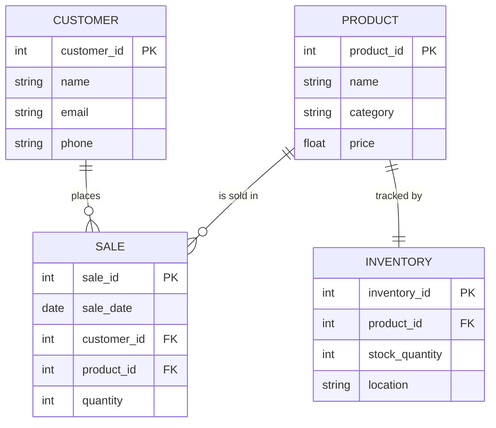

# Healthy Food Store – Entity Relationship Diagram (ERD)

This ERD represents the data structure of a small business that sells healthy food products, including fruits, vegetables, 
grains, and supplements. It tracks what products are available, customer information, sales transactions, and stock levels.

---

## 🥦 Overview

The store needs to manage:
- A catalog of healthy food products
- Customer information
- Sales history
- Inventory for each product

---

## 📦 Entities

### **PRODUCT**
- Stores data about each food item.
- Example: “Organic Bananas”, “Almond Milk”, “Quinoa”.

### **CUSTOMER**
- Stores name and contact details of each customer.

### **SALE**
- Tracks purchases, including product, customer, date, and quantity.

### **INVENTORY**
- Tracks how much of each product is in stock and where it is stored.

---

## 🔗 Relationships

- Each **Customer** can place many **Sales**.
- Each **Sale** is linked to one **Product**.
- Each **Product** has one associated **Inventory** record.

---

## ✅ Business Value

- Helps the store manage product availability
- Tracks customer purchases for loyalty or marketing
- Supports restocking by showing real-time inventory levels

